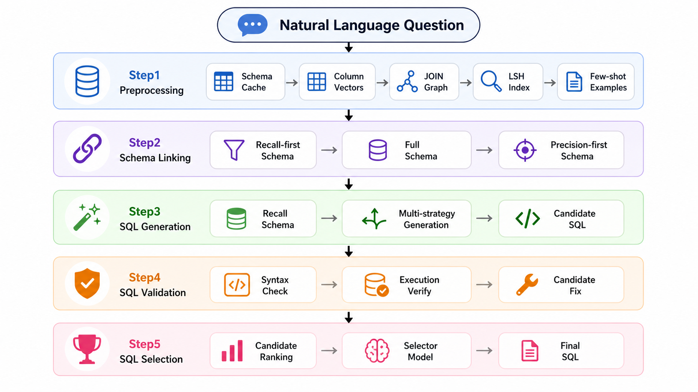

<div align="center">
<h1>DataGallery Text2SQL BIRD pipeline</h1>
<p><strong>面向 BIRD 评测榜单的端到端 Text-to-SQL 流水线</strong></p>


<p>
  
  
  
  
</p>

<p>
  <a href="#项目简介">项目简介</a> ·
  <a href="#核心特性">核心特性</a> ·
  <a href="#实验结果">实验结果</a> ·
  <a href="#目录结构">目录结构</a> ·
  <a href="#流程总览">流程总览</a> ·
  <a href="#安装">安装</a> ·
  <a href="#快速开始">快速开始</a> ·
  <a href="#两阶段执行模型">执行模型</a> ·
  <a href="#评测">评测</a>
</p>
</div>

---

<table>
  <tr>
    <td width="52%">
      <h3>项目简介</h3>
      <p>
        本项目是 DataGallery 项目里的核心技术 <strong>Text-to-SQL，作为一条可复现、可断点续跑的多阶段工程流水线用于 BIRD 榜单评测</strong>。它把任务拆解为<strong>预处理（元数据增强）</strong>、
        <strong>Schema Linking</strong>、<strong>SQL 生成</strong>、<strong>SQL 校验</strong> 与
        <strong>SQL 选择</strong> 五个环节。
      </p>
      <p>
        仓库面向 <strong>BIRD</strong> 评测榜单，提供从原始数据集到最终预测 JSON 的完整复现链路，
        所有步骤均支持 <strong>断点续跑（Resume-on-rerun）</strong>，用于适配 BIRD 评测环境。
      </p>
    </td>
    <td width="48%">
      <h3>核心思路</h3>
      <ul>
        <li><strong>预处理-元数据增强（Step1）</strong>：一次性进行元数据提取和增强，包括 schema 缓存、列描述、列/值向量、JOIN 图、LSH 索引、值枚举描述与 few-shot 示例的提取和生成</li>
        <li><strong>Schema Linking（Step2）</strong>：产出召回优先 / 全量 / 精确优先三套 schema</li>
        <li><strong>SQL 生成（Step3b）</strong>：基于召回优先 schema 用多生成器产出候选 SQL</li>
        <li><strong>SQL 校验</strong>：执行基于 SQL 语法和执行结果的校验</li>
        <li><strong>SQL 选择（Step4a）</strong>：用增训 selector 输出最终 SQL</li>
      </ul>
    </td>
  </tr>
</table>


## 核心特性

<table>
  <tr>
    <td>🧱</td>
    <td><strong>语义层构建优先</strong>：在生成任何 SQL 之前，先一次性构建丰富的语义信息，包括各类增强后的元数据。</td>
  </tr>
  <tr>
    <td>🔗</td>
    <td><strong>多策略 Schema Linking</strong>：召回优先 / 全量 / 精确优先三套 schema 灵活组合。</td>
  </tr>
  <tr>
    <td>🌿</td>
    <td><strong>多路 SQL 生成</strong>：分治（Divide-and-Conquer）、分步（Stepwise）、示例驱动（Exemplar/ICL）多生成器并行产出多样化候选 SQL。</td>
  </tr>
  <tr>
    <td>🧪</td>
    <td><strong>全面 SQL 修订</strong>：基于真实执行反馈与SQL语法进行执行/合规修复。</td>
  </tr>
  <tr>
    <td>💾</td>
    <td><strong>断点续传</strong>：全部 4 个步骤均支持重跑自动续跑，长任务可中断恢复，适配 BIRD 评测环境。</td>
  </tr>
</table>

## BIRD 榜单结果

> 榜单详情见 [BIRD 官方网站](https://bird-bench.github.io/)。

| 基准 | 指标 | 分数 | 模型 |
| --- | --- | ---: | --- |
| BIRD-Dev | EX | 74.64 | GLM 5.1 |
| BIRD-Test | EX | 77.53 | GLM 5.1 |

## 流程总览



```text
自然语言问题
        |
        v
1. 预处理 / 元数据增强（Step1）
   schema 缓存、列描述、列/值向量、JOIN 图、
   LSH 索引、值枚举描述、few-shot 示例
        |
        v
2. Schema Linking（Step2）
   产出 召回优先 / 全量 / 精确优先 三套 schema 文件
        |
        v
3. SQL 生成（Step3b）
   基于召回优先 schema + 多路策略生成候选 SQL
        |
        v
4. SQL 校验
   通过校验语法 + 执行结果修复候选
        |
        v
5. SQL 选择（Step4a）
   增训 selector 输出最终 SQL 预测
```

## 目录结构

```text
nl2sql/
├── client/           # LLM 客户端与 本地缓存调用接口
├── common/           # 公共工具（prompt 工具、原子 IO 等）
├── data/             # BIRD 数据集（dev）和 few shot 缓存
├── few_shot/         # few-shot 示例选择与生成
├── generator/        # SQL 候选生成器
├── log/              # 运行日志
├── preprocess/       # Step1 预处理
├── runner/           # 入口脚本（Step1 – Step4a）
├── schema_linker/    # Step2 Schema Linking
├── selector/         # SQL 选择：Top-K 执行（仅用于评测 SQL 生成质量）
├── sft_selector/     # Step4a 增训 selector 推理
├── sql_evaluator/    # SQL 执行与评测
├── validator/        # SQL 校验：语法 + 执行结果修复
├── workspace/        # 执行缓存目录
└── config.py         # 服务 URL、路径、LLM provider 等关键配置
```

### 关键入口脚本

- `nl2sql/runner/step1_run_preprocess.py`：在 workspace 中构建增强元数据
- `nl2sql/runner/step2_run_schema_linker.py`：为问题集产出 schema 文件
- `nl2sql/runner/step3b_run_nl2sql_single_combination.py`：单组合 SQL 生成
- `nl2sql/runner/step4a_sft_runner.py`：SFT selector → 最终预测 JSON

## 安装

### 环境要求

- Python `3.14`（本地实测版本）
- 推荐 Linux / macOS 环境
- 每个阶段需可用的 OpenAI 兼容 LLM 端点
- step1/2 需要 Embedding 端点或本地 Embedding 模型

### 安装依赖

```bash
pip install -r requirements.txt
```

## 数据集准备

按现有 `dev` 结构，将 BIRD 数据集放入 `nl2sql/data/`：

```text
nl2sql/data/
└── dev/                          ← 当前 dev 拆分（参考）
    ├── dev.json                  ← 问题 + 标准 SQL
    ├── dev_tables.json           ← 表/列 schema 元数据
    └── dev_databases/            ← 每个数据库一个子目录
        └── <db_name>/
            └── <db_name>.sqlite
```

## 配置

关键配置集中在 **`nl2sql/config.py`**（服务 URL、路径、LLM provider 配置）。
切换数据拆分时，更新如下路径：

```python
# ── config.py L37-40 ──
BIRD_DATA_DIR    = NL2SQL_DIR / "data" / "test"       # 例如 "test"
DEV_JSON         = str(BIRD_DATA_DIR / "test.json")   # 例如 "test.json"
BIRD_DB_DIR      = str(BIRD_DATA_DIR / "test_databases")
BIRD_TABLES_JSON = str(BIRD_DATA_DIR / "test_tables.json")
```

> **说明**
> - 各阶段可使用不同的 LLM provider（在 `config.py` 中配置）。
> - 服务 URL、并发度等参数同样在 `config.py` 中维护。

## 快速开始

按顺序运行四个步骤。建议统一使用**模块模式**（`python -m ...`）以避免 import / 工作目录问题。

### Step1 — 元数据增强

```bash
python -m nl2sql.runner.step1_run_preprocess --verbose
# 续跑：相同命令（自动续跑，无需额外参数）
# 典型耗时：约 2 小时（dev）
```

### Step2 — Schema Linker

```bash
python -m nl2sql.runner.step2_run_schema_linker --verbose
# 续跑：python -m nl2sql.runner.step2_run_schema_linker --resume --verbose
# 典型耗时：约 4 小时（dev）
```

### Step3b — SQL 生成

```bash
python -m nl2sql.runner.step3b_run_nl2sql_single_combination \
  --run-id {step3b_run_id} \
  --schema-json recall_first_schema.json \
  --llm-provider or_glm51 \
  --fr-force-on \
  --max-workers 5
# 续跑：相同命令（自动续跑，无需额外参数）
# 典型耗时：约 8 小时（dev）
```

### Step4a — SFT Selector（输出最终预测 JSON）

```bash
CUDA_VISIBLE_DEVICES=PLACEHOLDER python -m nl2sql.runner.step4a_sft_runner \
  --run-id {step4a_run_id} \
  --source-run-id {step3b_run_id} \
  --model-path nl2sql/workspace/sft_selector/model \
  --output-name predict_dev_sft_selector.json
# 续跑：相同命令（自动续跑，无需额外参数）
# 输出：最终预测 JSON 位于 nl2sql/output/{output-name}
# 典型耗时：约 30 分钟（dev，RTX 3090）
```

## 评测

Step4a 产出的最终预测 JSON（`nl2sql/output/{output-name}`）即为 BIRD 的评测提交产物。

## License

本项目基于 Apache License 2.0 发布，详见 [LICENSE](LICENSE)。

## 致谢

本项目基于公开评测基准生态（BIRD）与 OpenAI 兼容的 LLM 服务栈构建。
关于 BIRD 打榜如有问题，请联系打榜参与人员：

| 姓名 | 邮箱 |
| --- | --- |
| 程瑜飞 | chengyufeiwork@gmail.com |
| 李润辉 | lrhdiy@gmail.com |
| 刘中一 | zyaireliu@outlook.com |
| 沈佳羽 | shenjiayu.hust@foxmail.com |
| 张豪 | zhanghao739@huawei.com |
