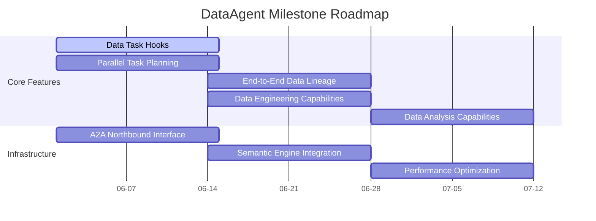

---
hide:
  - navigation
---

# DataAgent Milestone

  
  
  

---

## Roadmap

---

## Features

### Core Features

| # | Feature | Description | Timeline | Status |
|---|---|---|---|---|
| 1 | Data Task Hooks | Build data task related hooks | 06-01 ~ 06-14 | ⬜ |
| 2 | Parallel Task Planning | Data-affinity-aware parallel planning | 06-01 ~ 06-14 | ⬜ |
| 3 | End-to-End Data Lineage | Clear display of the end-to-end data flow process | 06-14 ~ 06-28 | ⬜ |
| 4 | Data Engineering Capabilities | Feature engineering and other vertical data engineering | 06-14 ~ 06-28 | ⬜ |
| 5 | Data Analysis Capabilities | Stronger data analysis capabilities | 06-28 ~ 07-12 | ⬜ |
| 6 | ... | ... | ... | ⬜ |

### Infrastructure

| # | Feature | Description | Timeline | Status |
|---|---|---|---|---|
| 1 | A2A Northbound Interface | Streaming, interrupt, and other A2A protocol capabilities | 06-01 ~ 06-14 | ⬜ |
| 2 | Semantic Engine Integration | Enhance data semantic perception module | 06-14 ~ 06-28 | ⬜ |
| 3 | Performance Optimization | Throughput QPS and parallelism optimization | 06-28 ~ 07-12 | ⬜ |

---

## Changelog

| Date | Update |
|---|---|
| 2026-05-31 | Initialized milestone document |

---

  DataAgent Milestone

