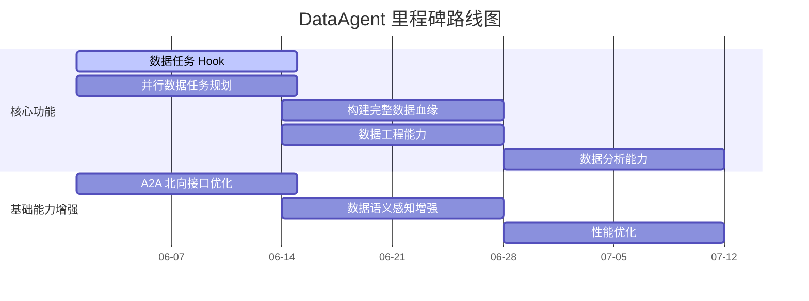

---
hide:
  - navigation
---

# DataAgent 里程碑

  
  
  

---

## 路线图

---

## 功能规划

### 核心功能

| # | 功能 | 描述 | 时间 | 状态 |
|---|---|---|---|---|
| 1 | 数据任务 Hook | 构建数据任务相关 Hook | 06-01 ~ 06-14 | ⬜ |
| 2 | 并行数据任务规划 | 面向数据亲和的并行规划 | 06-01 ~ 06-14 | ⬜ |
| 3 | 构建完整数据血缘 | 数据端到端流转过程清晰展示 | 06-14 ~ 06-28 | ⬜ |
| 4 | 数据工程能力 | 特征开发等垂域数据工程能力 | 06-14 ~ 06-28 | ⬜ |
| 5 | 数据分析能力 | 更强的数据分析能力 | 06-28 ~ 07-12 | ⬜ |
| 6 | ... | ... | ... | ⬜ |

### 基础能力增强

| # | 功能 | 描述 | 时间 | 状态 |
|---|---|---|---|---|
| 1 | A2A 北向接口优化 | 对接 A2A 框架的流式、中断等能力 | 06-01 ~ 06-14 | ⬜ |
| 2 | 对接语义引擎 | 完善数据语义感知增强模块 | 06-14 ~ 06-28 | ⬜ |
| 3 | 性能优化 | 吞吐 QPS 和并行度优化 | 06-28 ~ 07-12 | ⬜ |

---

## 更新日志

| 日期 | 更新内容 |
|---|---|
| 2026-05-31 | 初始化里程碑文档 |

---

  DataAgent Milestone

